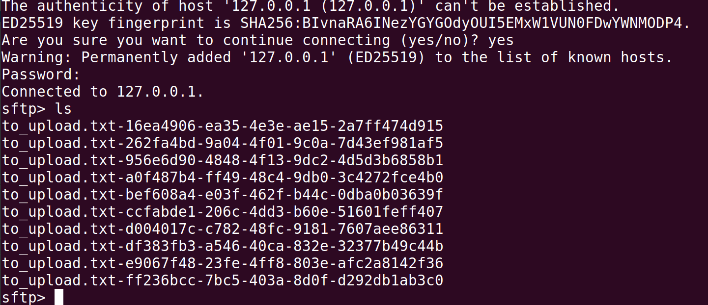

# sftp-pool
Simple solution to connect at SFTP using Pool strategy

### Requirements
1. OpenJDK 11
2. Gradle 7.0
3. Docker

### Dependencies
```
implementation group: 'com.pastdev', name: 'jsch-extension', version: '0.1.11'

implementation group: 'org.apache.commons', name: 'commons-pool2', version: '2.6.2'
```

### Try local
1. Run SFTP Server (test only)
```
docker run -p 22:22 emberstack/sftp --name sftp
```
2. Create a SessionPool for SFTP Connection
```java
DefaultSessionFactory sessionFactory = new DefaultSessionFactory();
sessionFactory.setHostname("127.0.0.1");
sessionFactory.setUsername("demo");
sessionFactory.setPassword("demo");
sessionFactory.setConfig("StrictHostKeyChecking", "no");

SessionManager sm = new SessionManager(sessionFactory);
```
3. Create a pool
```java
ObjectPool<ChannelSftp> pool =
        ChannelSftpConnectionsFactory.createPool(sm, new GenericObjectPoolConfig<>());
```
4. Try to upload a sample file 
```java
// Get file from resources
URL res = getClass().getClassLoader().getResource("to_upload.txt");
File file = Paths.get(res.toURI()).toFile();
```
5. Excute with a Lambda fashion
```java
ChannelSftpConnectionsFactory.execute(
      pool,
      sftp -> {
        try {
          sftp.put(
              new FileInputStream(file),
              String.format(file.getName() + "-%s", 
              UUID.randomUUID()),
              ChannelSftp.OVERWRITE);
        } catch (SftpException e) {
          e.printStackTrace();
        } catch (FileNotFoundException e) {
          e.printStackTrace();
        }
      },
      e -> {
        e.printStackTrace();
      });
```
This excecute the operation over a sftp object (inside a poll) and handle any exception throwed

6. Connect to SFTP using cli and run "ls" command
```
sftp demo@127.0.0.1
```
